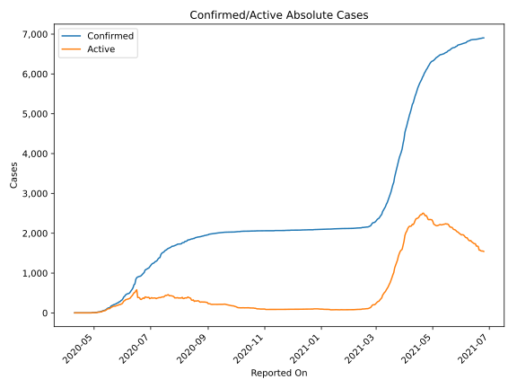
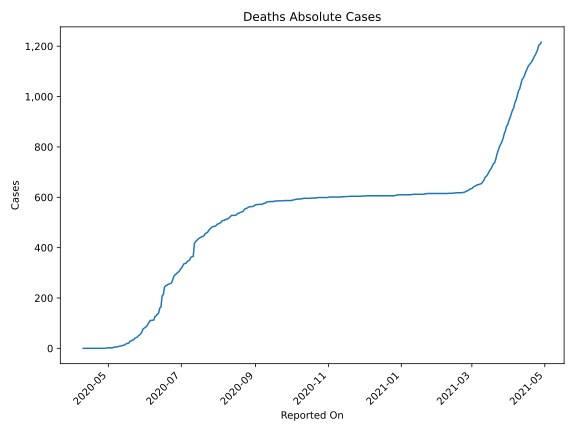
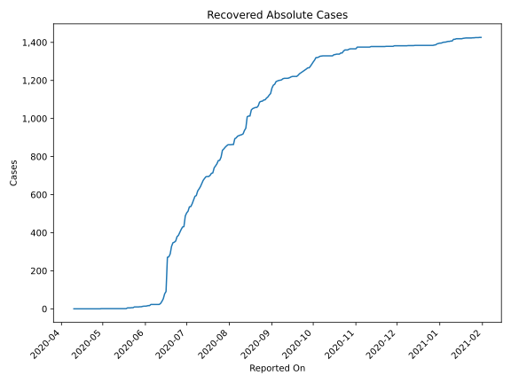
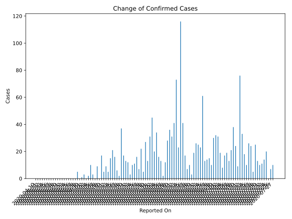
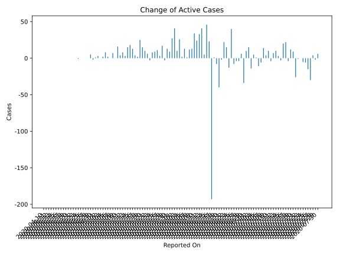
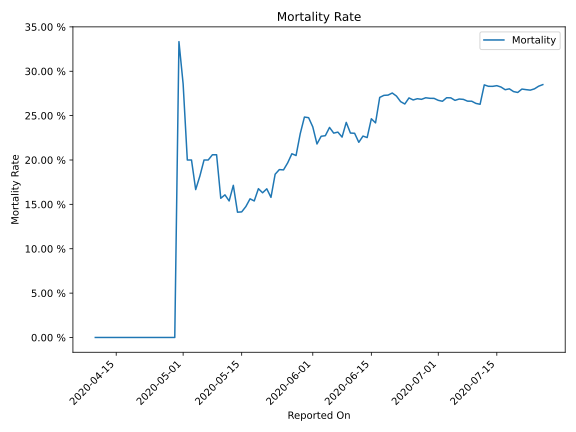

# Country Figures: Time Series for Yemen 

| Reported On | Confirmed | Deaths | Recovered | Active | Mortality | &Delta; Confirmed | &Delta; Deaths | &Delta; Recovered | &Delta; Active | % Active of Population |
|-------------|-----------|--------|-----------|--------|-----------|-------------------|----------------|-------------------|----------------|------------------------|
| 2020-05-08 | 34 | 7 | 1 | 26 |  20.59 %  | 9 | 2 | 0 | 7 |  0.000 %  | 
| 2020-05-07 | 25 | 5 | 1 | 19 |  20.00 %  | 0 | 0 | 0 | 0 |  0.000 %  | 
| 2020-05-06 | 25 | 5 | 1 | 19 |  20.00 %  | 3 | 1 | 0 | 2 |  0.000 %  | 
| 2020-05-05 | 22 | 4 | 1 | 17 |  18.18 %  | 10 | 2 | 0 | 8 |  0.000 %  | 
| 2020-05-04 | 12 | 2 | 1 | 9 |  16.67 %  | 2 | 0 | 0 | 2 |  0.000 %  | 
| 2020-05-03 | 10 | 2 | 1 | 7 |  20.00 %  | 0 | 0 | 0 | 0 |  0.000 %  | 
| 2020-05-02 | 10 | 2 | 1 | 7 |  20.00 %  | 3 | 0 | 0 | 3 |  0.000 %  | 
| 2020-05-01 | 7 | 2 | 1 | 4 |  28.57 %  | 1 | 0 | 0 | 1 |  0.000 %  | 
| 2020-04-30 | 6 | 2 | 1 | 3 |  33.33 %  | 0 | 2 | 0 | -2 |  0.000 %  | 
| 2020-04-29 | 6 | 0 | 1 | 5 |  None  | 5 | 0 | 0 | 5 |  0.000 %  | 
| 2020-04-28 | 1 | 0 | 1 | 0 |  None  | 0 | 0 | 0 | 0 |  n/a  | 
| 2020-04-27 | 1 | 0 | 1 | 0 |  None  | 0 | 0 | 0 | 0 |  n/a  | 
| 2020-04-26 | 1 | 0 | 1 | 0 |  None  | 0 | 0 | 0 | 0 |  n/a  | 
| 2020-04-25 | 1 | 0 | 1 | 0 |  None  | 0 | 0 | 0 | 0 |  n/a  | 
| 2020-04-24 | 1 | 0 | 1 | 0 |  None  | 0 | 0 | 1 | -1 |  n/a  | 
| 2020-04-23 | 1 | 0 | 0 | 1 |  None  | 0 | 0 | 0 | 0 |  0.000 %  | 
| 2020-04-22 | 1 | 0 | 0 | 1 |  None  | 0 | 0 | 0 | 0 |  0.000 %  | 
| 2020-04-21 | 1 | 0 | 0 | 1 |  None  | 0 | 0 | 0 | 0 |  0.000 %  | 
| 2020-04-20 | 1 | 0 | 0 | 1 |  None  | 0 | 0 | 0 | 0 |  0.000 %  | 
| 2020-04-19 | 1 | 0 | 0 | 1 |  None  | 0 | 0 | 0 | 0 |  0.000 %  | 
| 2020-04-18 | 1 | 0 | 0 | 1 |  None  | 0 | 0 | 0 | 0 |  0.000 %  | 
| 2020-04-17 | 1 | 0 | 0 | 1 |  None  | 0 | 0 | 0 | 0 |  0.000 %  | 
| 2020-04-16 | 1 | 0 | 0 | 1 |  None  | 0 | 0 | 0 | 0 |  0.000 %  | 
| 2020-04-15 | 1 | 0 | 0 | 1 |  None  | 0 | 0 | 0 | 0 |  0.000 %  | 
| 2020-04-14 | 1 | 0 | 0 | 1 |  None  | 0 | 0 | 0 | 0 |  0.000 %  | 
| 2020-04-13 | 1 | 0 | 0 | 1 |  None  | 0 | 0 | 0 | 0 |  0.000 %  | 
| 2020-04-12 | 1 | 0 | 0 | 1 |  None  | 0 | 0 | 0 | 0 |  0.000 %  | 
| 2020-04-11 | 1 | 0 | 0 | 1 |  None  | 0 | 0 | 0 | 0 |  0.000 %  | 
| 2020-04-10 | 1 | 0 | 0 | 1 |  None  | None | None | None | None |  0.000 %  | 

