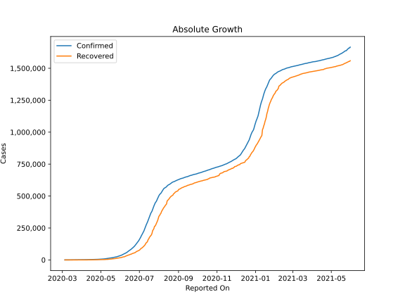
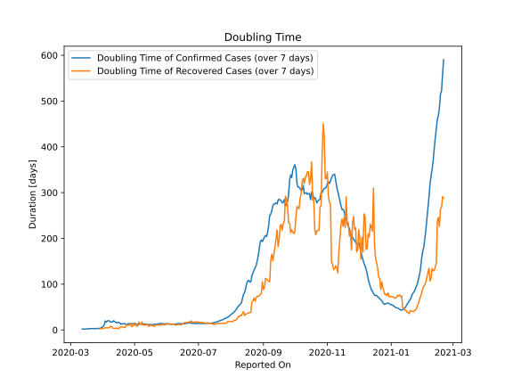

# Country Figures: Doubling Time of Infections for SouthAfrica 

The doubling time below are calculated based on
* an exponential growth assumption
* for time difference of past seven (7) days.
The doubling time's unit is "days".

The first doubling time indicates the increase of confirmed (infected)
cases. There, the *higher* the number is, the better is to take control
of the disease.

The second doubling time indicates the increase of recovered (healed)
cases. There, the *lower* the number is, the better it is to take
control of the disease.

| Reported On | Confirmed | Doubling Time (Confirmed) | Recovered | Doubling Time (Recovered) |
|-------------|-----------|---------------------------|-----------|---------------------------|
| 2020-04-13 | 2272 |  16.6 days  | 410 |  3.7 days  | 
| 2020-04-12 | 2173 |  18.2 days  | 410 |  3.7 days  | 
| 2020-04-11 | 2028 |  20.0 days  | 410 |  3.7 days  | 
| 2020-04-10 | 2003 |  17.3 days  | 410 |  3.7 days  | 
| 2020-04-09 | 1934 |  17.7 days  | 95 |  7.9 days  | 
| 2020-04-08 | 1845 |  17.1 days  | 95 |  7.9 days  | 
| 2020-04-07 | 1749 |  19.2 days  | 95 |  4.7 days  | 
| 2020-04-06 | 1686 |  20.5 days  | 95 |  4.7 days  | 
| 2020-04-05 | 1655 |  19.2 days  | 95 |  4.7 days  | 
| 2020-04-04 | 1585 |  17.1 days  | 95 |  4.7 days  | 
| 2020-04-03 | 1505 |  19.6 days  | 95 |  4.7 days  | 
| 2020-04-02 | 1462 |  11.0 days  | 50 |  3.7 days  | 
| 2020-04-01 | 1380 |  7.6 days  | 50 |  3.7 days  | 
| 2020-03-31 | 1353 |  5.8 days  | 31 |  2.7 days  | 
| 2020-03-30 | 1326 |  4.4 days  | 31 |  2.7 days  | 
| 2020-03-29 | 1280 |  3.5 days  | 31 |  2.1 days  | 
| 2020-03-28 | 1187 |  3.4 days  | 31 |  None  | 
| 2020-03-27 | 1170 |  3.1 days  | 31 |  None  | 
| 2020-03-26 | 927 |  3.0 days  | 12 |  None  | 
| 2020-03-25 | 709 |  3.0 days  | 12 |  None  | 
| 2020-03-24 | 554 |  2.5 days  | 4 |  None  | 
| 2020-03-23 | 402 |  2.9 days  | 4 |  None  | 
| 2020-03-22 | 274 |  3.2 days  | 2 |  None  | 
| 2020-03-21 | 240 |  3.0 days  | 0 |  None  | 
| 2020-03-20 | 202 |  2.6 days  | 0 |  None  | 
| 2020-03-19 | 150 |  2.6 days  | 0 |  None  | 
| 2020-03-18 | 116 |  2.5 days  | 0 |  None  | 
| 2020-03-17 | 62 |  2.6 days  | 0 |  None  | 
| 2020-03-16 | 62 |  1.9 days  | 0 |  None  | 
| 2020-03-15 | 51 |  2.0 days  | 0 |  None  | 
| 2020-03-14 | 38 |  1.7 days  | 0 |  None  | 
| 2020-03-13 | 24 |  1.9 days  | 0 |  None  | 
| 2020-03-12 | 17 |  2.0 days  | 0 |  None  | 
| 2020-03-11 | 13 |  None  | 0 |  None  | 
| 2020-03-10 | 7 |  None  | 0 |  None  | 
| 2020-03-09 | 3 |  None  | 0 |  None  | 
| 2020-03-08 | 3 |  None  | 0 |  None  | 
| 2020-03-07 | 1 |  None  | 0 |  None  | 
| 2020-03-06 | 1 |  None  | 0 |  None  | 
| 2020-03-05 | 1 |  None  | 0 |  None  | 

