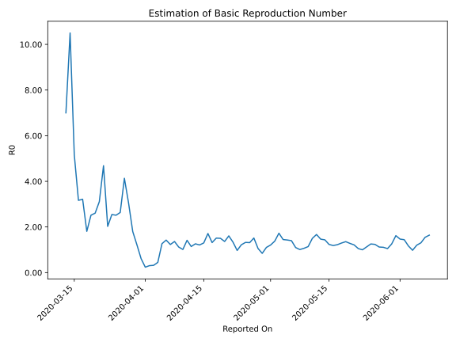

# Country Figures: Time Series for Basic Reproduction Number of SouthAfrica 

| Reported On | &Delta; Confirmed | Total &Delta; Confirmed First Interval | Total &Delta; Confirmed Second Interval | Estimated Basic Reproduction Number R0 | 
|-------------|-------------------|----------------------------------------|-----------------------------------------|---------------------------------------------------|
| 2020-04-27 | 247 |  911  |  601  |  1.52  | 
| 2020-04-26 | 185 |  896  |  682  |  1.31  | 
| 2020-04-25 | 141 |  920  |  695  |  1.32  | 
| 2020-04-24 | 267 |  795  |  652  |  1.22  | 
| 2020-04-23 | 318 |  601  |  619  |  0.97  | 
| 2020-04-22 | 170 |  682  |  511  |  1.33  | 
| 2020-04-21 | 165 |  695  |  432  |  1.61  | 
| 2020-04-20 | 142 |  652  |  478  |  1.36  | 
| 2020-04-19 | 124 |  619  |  412  |  1.50  | 
| 2020-04-18 | 251 |  511  |  338  |  1.51  | 
| 2020-04-17 | 178 |  432  |  328  |  1.32  | 
| 2020-04-16 | 99 |  478  |  279  |  1.71  | 
| 2020-04-15 | 91 |  412  |  317  |  1.30  | 
| 2020-04-14 | 143 |  338  |  279  |  1.21  | 
| 2020-04-13 | 99 |  328  |  260  |  1.26  | 
| 2020-04-12 | 145 |  279  |  244  |  1.14  | 
| 2020-04-11 | 25 |  317  |  224  |  1.42  | 
| 2020-04-10 | 69 |  279  |  275  |  1.01  | 
| 2020-04-09 | 89 |  260  |  232  |  1.12  | 
| 2020-04-08 | 96 |  244  |  179  |  1.36  | 
| 2020-04-07 | 63 |  224  |  182  |  1.23  | 
| 2020-04-06 | 31 |  275  |  193  |  1.42  | 
| 2020-04-05 | 70 |  232  |  183  |  1.27  | 
| 2020-04-04 | 80 |  179  |  399  |  0.45  | 
| 2020-04-03 | 43 |  182  |  571  |  0.32  | 
| 2020-04-02 | 82 |  193  |  633  |  0.30  | 
| 2020-04-01 | 27 |  183  |  768  |  0.24  | 
| 2020-03-31 | 27 |  399  |  653  |  0.61  | 
| 2020-03-30 | 46 |  571  |  469  |  1.22  | 
| 2020-03-29 | 93 |  633  |  352  |  1.80  | 
| 2020-03-28 | 17 |  768  |  252  |  3.05  | 
| 2020-03-27 | 243 |  653  |  158  |  4.13  | 
| 2020-03-26 | 218 |  469  |  178  |  2.63  | 
| 2020-03-25 | 155 |  352  |  140  |  2.51  | 
| 2020-03-24 | 152 |  252  |  99  |  2.55  | 
| 2020-03-23 | 128 |  158  |  78  |  2.03  | 
| 2020-03-22 | 34 |  178  |  38  |  4.68  | 
| 2020-03-21 | 38 |  140  |  45  |  3.11  | 
| 2020-03-20 | 52 |  99  |  38  |  2.61  | 
| 2020-03-19 | 34 |  78  |  31  |  2.52  | 
| 2020-03-18 | 54 |  38  |  21  |  1.81  | 
| 2020-03-17 | 0 |  45  |  14  |  3.21  | 
| 2020-03-16 | 11 |  38  |  12  |  3.17  | 
| 2020-03-15 | 13 |  31  |  6  |  5.17  | 
| 2020-03-14 | 14 |  21  |  2  |  10.50  | 
| 2020-03-13 | 7 |  14  |  2  |  7.00  | 
| 2020-03-12 | 4 |  12  |  None  |  None  | 
| 2020-03-11 | 6 |  6  |  None  |  None  | 
| 2020-03-10 | 4 |  2  |  None  |  None  | 
| 2020-03-09 | 0 |  2  |  None  |  None  | 
| 2020-03-08 | 2 |  None  |  None  |  None  | 
| 2020-03-07 | 0 |  None  |  None  |  None  | 
| 2020-03-06 | 0 |  None  |  None  |  None  | 
| 2020-03-05 | None |  None  |  None  |  None  | 

