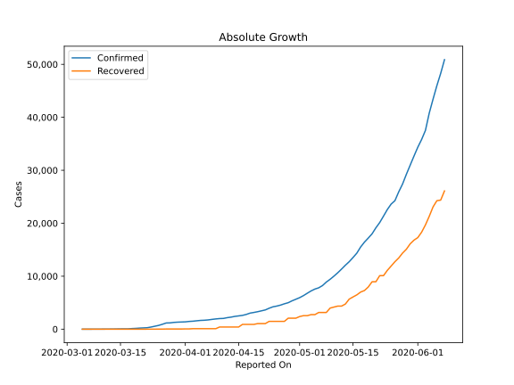
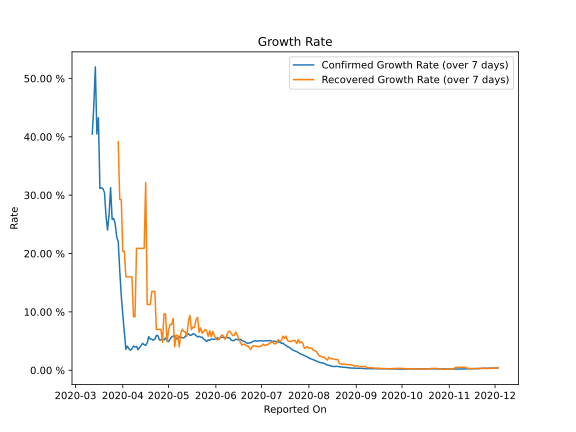

# Country Figures: Growth Rate for SouthAfrica 

The growth rates below are calculated based on
* an exponential growth assumption
* for time difference of past seven (7) days.

The first growth rate indicates the increase of confirmed (infected) cases.

The second growth rate indicates the increase of recovered (healed) cases.

| Reported On | Confirmed | Growth Rate (Confirmed) | Recovered | Growth Rate (Recovered) |
|-------------|-----------|-------------------------|-----------|-------------------------|
| 2020-03-22 | 274 |  24.02 %  | 0 |  None  | 
| 2020-03-21 | 240 |  26.33 %  | 0 |  None  | 
| 2020-03-20 | 202 |  30.43 %  | 0 |  None  | 
| 2020-03-19 | 150 |  31.11 %  | 0 |  None  | 
| 2020-03-18 | 116 |  31.27 %  | 0 |  None  | 
| 2020-03-17 | 62 |  31.16 %  | 0 |  None  | 
| 2020-03-16 | 62 |  43.26 %  | 0 |  None  | 
| 2020-03-15 | 51 |  40.47 %  | 0 |  None  | 
| 2020-03-14 | 38 |  None  | 0 |  None  | 
| 2020-03-13 | 24 |  None  | 0 |  None  | 
| 2020-03-12 | 17 |  None  | 0 |  None  | 
| 2020-03-11 | 13 |  None  | 0 |  None  | 
| 2020-03-10 | 7 |  None  | 0 |  None  | 
| 2020-03-09 | 3 |  None  | 0 |  None  | 
| 2020-03-08 | 3 |  None  | 0 |  None  | 
| 2020-03-07 | 1 |  None  | 0 |  None  | 
| 2020-03-06 | 1 |  None  | 0 |  None  | 
| 2020-03-05 | 1 |  None  | 0 |  None  | 

