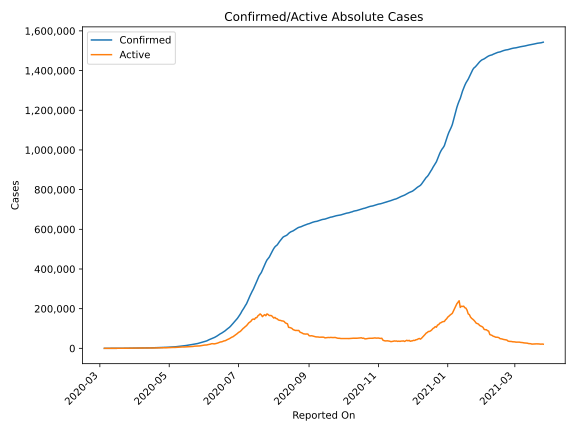
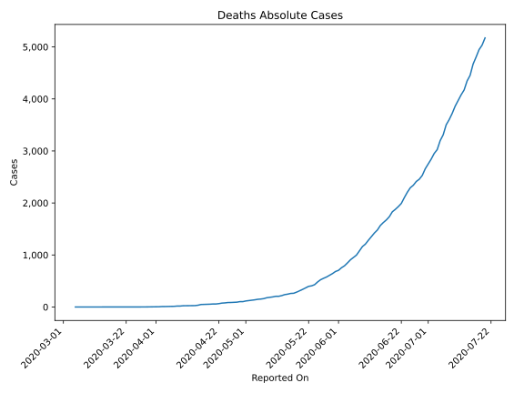
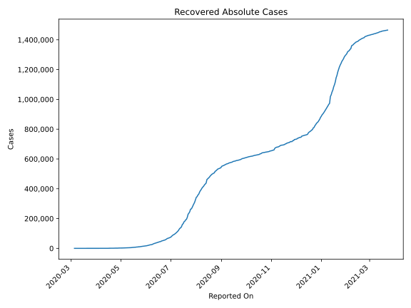
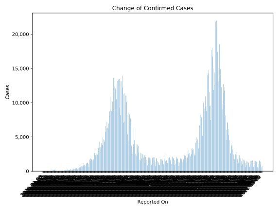
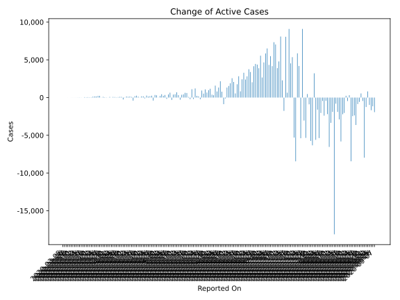
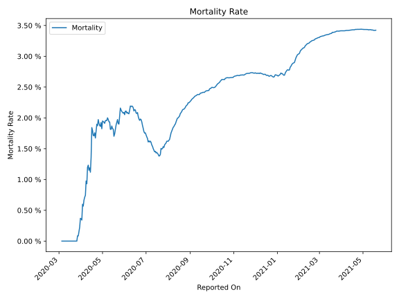

# Country Figures: Time Series for SouthAfrica 

| Reported On | Confirmed | Deaths | Recovered | Active | Mortality | &Delta; Confirmed | &Delta; Deaths | &Delta; Recovered | &Delta; Active | % Active of Population |
|-------------|-----------|--------|-----------|--------|-----------|-------------------|----------------|-------------------|----------------|------------------------|
| 2020-04-21 | 3465 | 58 | 1055 | 2352 |  1.67 %  | 165 | 0 | 0 | 165 |  0.004 %  | 
| 2020-04-20 | 3300 | 58 | 1055 | 2187 |  1.76 %  | 142 | 4 | 152 | -14 |  0.004 %  | 
| 2020-04-19 | 3158 | 54 | 903 | 2201 |  1.71 %  | 124 | 2 | 0 | 122 |  0.004 %  | 
| 2020-04-18 | 3034 | 52 | 903 | 2079 |  1.71 %  | 251 | 2 | 0 | 249 |  0.004 %  | 
| 2020-04-17 | 2783 | 50 | 903 | 1830 |  1.80 %  | 178 | 2 | 0 | 176 |  0.003 %  | 
| 2020-04-16 | 2605 | 48 | 903 | 1654 |  1.84 %  | 99 | 14 | 493 | -408 |  0.003 %  | 
| 2020-04-15 | 2506 | 34 | 410 | 2062 |  1.36 %  | 91 | 7 | 0 | 84 |  0.004 %  | 
| 2020-04-14 | 2415 | 27 | 410 | 1978 |  1.12 %  | 143 | 0 | 0 | 143 |  0.003 %  | 
| 2020-04-13 | 2272 | 27 | 410 | 1835 |  1.19 %  | 99 | 2 | 0 | 97 |  0.003 %  | 
| 2020-04-12 | 2173 | 25 | 410 | 1738 |  1.15 %  | 145 | 0 | 0 | 145 |  0.003 %  | 
| 2020-04-11 | 2028 | 25 | 410 | 1593 |  1.23 %  | 25 | 1 | 0 | 24 |  0.003 %  | 
| 2020-04-10 | 2003 | 24 | 410 | 1569 |  1.20 %  | 69 | 6 | 315 | -252 |  0.003 %  | 
| 2020-04-09 | 1934 | 18 | 95 | 1821 |  0.93 %  | 89 | 0 | 0 | 89 |  0.003 %  | 
| 2020-04-08 | 1845 | 18 | 95 | 1732 |  0.98 %  | 96 | 5 | 0 | 91 |  0.003 %  | 
| 2020-04-07 | 1749 | 13 | 95 | 1641 |  0.74 %  | 63 | 1 | 0 | 62 |  0.003 %  | 
| 2020-04-06 | 1686 | 12 | 95 | 1579 |  0.71 %  | 31 | 1 | 0 | 30 |  0.003 %  | 
| 2020-04-05 | 1655 | 11 | 95 | 1549 |  0.66 %  | 70 | 2 | 0 | 68 |  0.003 %  | 
| 2020-04-04 | 1585 | 9 | 95 | 1481 |  0.57 %  | 80 | 0 | 0 | 80 |  0.003 %  | 
| 2020-04-03 | 1505 | 9 | 95 | 1401 |  0.60 %  | 43 | 4 | 45 | -6 |  0.002 %  | 
| 2020-04-02 | 1462 | 5 | 50 | 1407 |  0.34 %  | 82 | 0 | 0 | 82 |  0.002 %  | 
| 2020-04-01 | 1380 | 5 | 50 | 1325 |  0.36 %  | 27 | 0 | 19 | 8 |  0.002 %  | 
| 2020-03-31 | 1353 | 5 | 31 | 1317 |  0.37 %  | 27 | 2 | 0 | 25 |  0.002 %  | 
| 2020-03-30 | 1326 | 3 | 31 | 1292 |  0.23 %  | 46 | 1 | 0 | 45 |  0.002 %  | 
| 2020-03-29 | 1280 | 2 | 31 | 1247 |  0.16 %  | 93 | 1 | 0 | 92 |  0.002 %  | 
| 2020-03-28 | 1187 | 1 | 31 | 1155 |  0.08 %  | 17 | 0 | 0 | 17 |  0.002 %  | 
| 2020-03-27 | 1170 | 1 | 31 | 1138 |  0.09 %  | 243 | 1 | 19 | 223 |  0.002 %  | 
| 2020-03-26 | 927 | 0 | 12 | 915 |  None  | 218 | 0 | 0 | 218 |  0.002 %  | 
| 2020-03-25 | 709 | 0 | 12 | 697 |  None  | 155 | 0 | 8 | 147 |  0.001 %  | 
| 2020-03-24 | 554 | 0 | 4 | 550 |  None  | 152 | 0 | 0 | 152 |  0.001 %  | 
| 2020-03-23 | 402 | 0 | 4 | 398 |  None  | 128 | 0 | 2 | 126 |  0.001 %  | 
| 2020-03-22 | 274 | 0 | 2 | 272 |  None  | 34 | 0 | 2 | 32 |  0.000 %  | 
| 2020-03-21 | 240 | 0 | 0 | 240 |  None  | 38 | 0 | 0 | 38 |  0.000 %  | 
| 2020-03-20 | 202 | 0 | 0 | 202 |  None  | 52 | 0 | 0 | 52 |  0.000 %  | 
| 2020-03-19 | 150 | 0 | 0 | 150 |  None  | 34 | 0 | 0 | 34 |  0.000 %  | 
| 2020-03-18 | 116 | 0 | 0 | 116 |  None  | 54 | 0 | 0 | 54 |  0.000 %  | 
| 2020-03-17 | 62 | 0 | 0 | 62 |  None  | 0 | 0 | 0 | 0 |  0.000 %  | 
| 2020-03-16 | 62 | 0 | 0 | 62 |  None  | 11 | 0 | 0 | 11 |  0.000 %  | 
| 2020-03-15 | 51 | 0 | 0 | 51 |  None  | 13 | 0 | 0 | 13 |  0.000 %  | 
| 2020-03-14 | 38 | 0 | 0 | 38 |  None  | 14 | 0 | 0 | 14 |  0.000 %  | 
| 2020-03-13 | 24 | 0 | 0 | 24 |  None  | 7 | 0 | 0 | 7 |  0.000 %  | 
| 2020-03-12 | 17 | 0 | 0 | 17 |  None  | 4 | 0 | 0 | 4 |  0.000 %  | 
| 2020-03-11 | 13 | 0 | 0 | 13 |  None  | 6 | 0 | 0 | 6 |  0.000 %  | 
| 2020-03-10 | 7 | 0 | 0 | 7 |  None  | 4 | 0 | 0 | 4 |  0.000 %  | 
| 2020-03-09 | 3 | 0 | 0 | 3 |  None  | 0 | 0 | 0 | 0 |  0.000 %  | 
| 2020-03-08 | 3 | 0 | 0 | 3 |  None  | 2 | 0 | 0 | 2 |  0.000 %  | 
| 2020-03-07 | 1 | 0 | 0 | 1 |  None  | 0 | 0 | 0 | 0 |  0.000 %  | 
| 2020-03-06 | 1 | 0 | 0 | 1 |  None  | 0 | 0 | 0 | 0 |  0.000 %  | 
| 2020-03-05 | 1 | 0 | 0 | 1 |  None  | None | None | None | None |  0.000 %  | 

