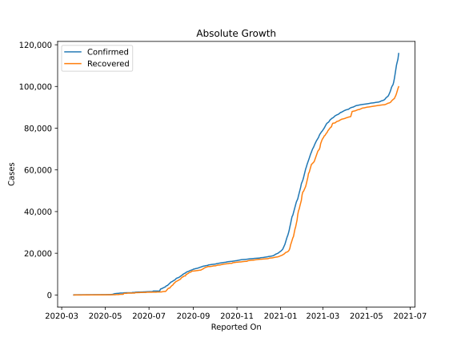
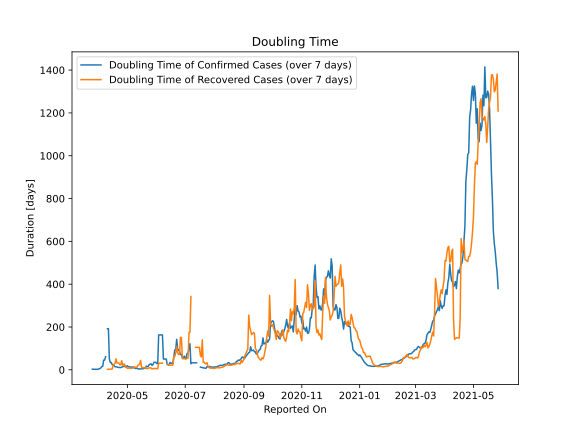

# Country Figures: Doubling Time of Infections for Zambia 

The doubling time below are calculated based on
* an exponential growth assumption
* for time difference of past seven (7) days.
The doubling time's unit is "days".

The first doubling time indicates the increase of confirmed (infected)
cases. There, the *higher* the number is, the better is to take control
of the disease.

The second doubling time indicates the increase of recovered (healed)
cases. There, the *lower* the number is, the better it is to take
control of the disease.

| Reported On | Confirmed | Doubling Time (Confirmed) | Recovered | Doubling Time (Recovered) |
|-------------|-----------|---------------------------|-----------|---------------------------|
| 2020-04-29 | 97 |  18.3 days  | 54 |  11.5 days  | 
| 2020-04-28 | 95 |  16.2 days  | 42 |  27.0 days  | 
| 2020-04-27 | 88 |  16.4 days  | 42 |  27.0 days  | 
| 2020-04-26 | 88 |  13.6 days  | 42 |  20.5 days  | 
| 2020-04-25 | 84 |  12.9 days  | 37 |  42.8 days  | 
| 2020-04-24 | 84 |  10.5 days  | 37 |  23.5 days  | 
| 2020-04-23 | 76 |  10.9 days  | 37 |  23.5 days  | 
| 2020-04-22 | 74 |  11.6 days  | 35 |  31.8 days  | 
| 2020-04-21 | 70 |  11.3 days  | 35 |  31.8 days  | 
| 2020-04-20 | 65 |  13.5 days  | 35 |  31.8 days  | 
| 2020-04-19 | 61 |  14.2 days  | 33 |  51.3 days  | 
| 2020-04-18 | 57 |  14.0 days  | 33 |  29.9 days  | 
| 2020-04-17 | 52 |  18.8 days  | 30 |  27.0 days  | 
| 2020-04-16 | 48 |  23.7 days  | 30 |  22.1 days  | 
| 2020-04-15 | 48 |  23.7 days  | 30 |  3.7 days  | 
| 2020-04-14 | 45 |  34.3 days  | 30 |  3.7 days  | 
| 2020-04-13 | 45 |  34.3 days  | 30 |  3.0 days  | 
| 2020-04-12 | 43 |  50.0 days  | 30 |  2.4 days  | 
| 2020-04-11 | 40 |  192.0 days  | 28 |  2.2 days  | 
| 2020-04-10 | 40 |  192.0 days  | 25 |  2.2 days  | 
| 2020-04-09 | 39 |  None  | 24 |  None  | 
| 2020-04-08 | 39 |  61.0 days  | 7 |  None  | 
| 2020-04-07 | 39 |  45.2 days  | 7 |  None  | 
| 2020-04-06 | 39 |  45.2 days  | 5 |  None  | 
| 2020-04-05 | 39 |  16.7 days  | 3 |  None  | 
| 2020-04-04 | 39 |  15.0 days  | 2 |  None  | 
| 2020-04-03 | 39 |  8.8 days  | 2 |  None  | 
| 2020-04-02 | 39 |  5.8 days  | 0 |  None  | 
| 2020-04-01 | 36 |  4.8 days  | 0 |  None  | 
| 2020-03-31 | 35 |  2.3 days  | 0 |  None  | 
| 2020-03-30 | 35 |  2.3 days  | 0 |  None  | 
| 2020-03-29 | 29 |  2.5 days  | 0 |  None  | 
| 2020-03-28 | 28 |  2.2 days  | 0 |  None  | 
| 2020-03-27 | 22 |  2.4 days  | 0 |  None  | 
| 2020-03-26 | 16 |  2.7 days  | 0 |  None  | 
| 2020-03-25 | 12 |  3.0 days  | 0 |  None  | 
| 2020-03-24 | 3 |  None  | 0 |  None  | 
| 2020-03-23 | 3 |  None  | 0 |  None  | 
| 2020-03-22 | 3 |  None  | 0 |  None  | 
| 2020-03-21 | 2 |  None  | 0 |  None  | 
| 2020-03-20 | 2 |  None  | 0 |  None  | 
| 2020-03-19 | 2 |  None  | 0 |  None  | 
| 2020-03-18 | 2 |  None  | 0 |  None  | 

