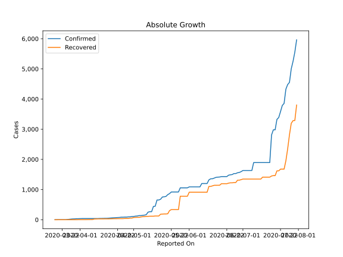
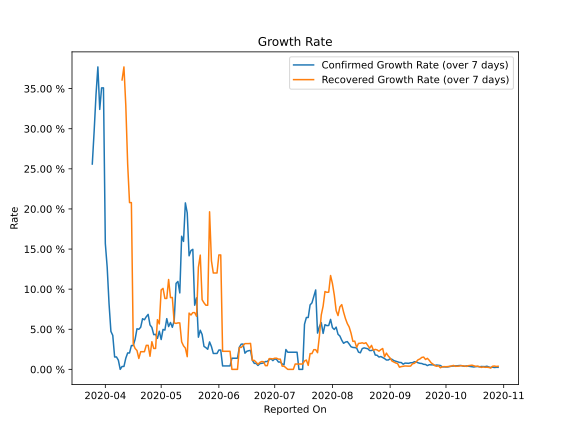

# Country Figures: Growth Rate for Zambia 

The growth rates below are calculated based on
* an exponential growth assumption
* for time difference of past seven (7) days.
The growth rate is to be understood as on "growth per day".

The first growth rate indicates the increase of confirmed (infected) cases.

The second growth rate indicates the increase of recovered (healed) cases.

| Reported On | Confirmed | Growth Rate (Confirmed) | Recovered | Growth Rate (Recovered) |
|-------------|-----------|-------------------------|-----------|-------------------------|
| 2020-05-04 | 137 |  6.32 %  | 78 |  8.843 %  | 
| 2020-05-03 | 124 |  4.90 %  | 78 |  8.843 %  | 
| 2020-05-02 | 119 |  4.98 %  | 75 |  10.094 %  | 
| 2020-05-01 | 109 |  3.72 %  | 74 |  9.902 %  | 
| 2020-04-30 | 106 |  4.75 %  | 55 |  5.663 %  | 
| 2020-04-29 | 97 |  3.87 %  | 54 |  6.195 %  | 
| 2020-04-28 | 95 |  4.36 %  | 42 |  2.605 %  | 
| 2020-04-27 | 88 |  4.33 %  | 42 |  2.605 %  | 
| 2020-04-26 | 88 |  5.24 %  | 42 |  3.445 %  | 
| 2020-04-25 | 84 |  5.54 %  | 37 |  1.634 %  | 
| 2020-04-24 | 84 |  6.85 %  | 37 |  2.996 %  | 
| 2020-04-23 | 76 |  6.56 %  | 37 |  2.996 %  | 
| 2020-04-22 | 74 |  6.18 %  | 35 |  2.202 %  | 
| 2020-04-21 | 70 |  6.31 %  | 35 |  2.202 %  | 
| 2020-04-20 | 65 |  5.25 %  | 35 |  2.202 %  | 
| 2020-04-19 | 61 |  5.00 %  | 33 |  1.362 %  | 
| 2020-04-18 | 57 |  5.06 %  | 33 |  2.347 %  | 
| 2020-04-17 | 52 |  3.75 %  | 30 |  2.605 %  | 
| 2020-04-16 | 48 |  2.97 %  | 30 |  3.188 %  | 
| 2020-04-15 | 48 |  2.97 %  | 30 |  20.790 %  | 
| 2020-04-14 | 45 |  2.04 %  | 30 |  20.790 %  | 
| 2020-04-13 | 45 |  2.04 %  | 30 |  25.597 %  | 
| 2020-04-12 | 43 |  1.39 %  | 30 |  32.894 %  | 
| 2020-04-11 | 40 |  0.36 %  | 28 |  37.701 %  | 
| 2020-04-10 | 40 |  0.36 %  | 25 |  36.082 %  | 
| 2020-04-09 | 39 |  None  | 24 |  None  | 
| 2020-04-08 | 39 |  1.14 %  | 7 |  None  | 
| 2020-04-07 | 39 |  1.55 %  | 7 |  None  | 
| 2020-04-06 | 39 |  1.55 %  | 5 |  None  | 
| 2020-04-05 | 39 |  4.23 %  | 3 |  None  | 
| 2020-04-04 | 39 |  4.73 %  | 2 |  None  | 
| 2020-04-03 | 39 |  8.18 %  | 2 |  None  | 
| 2020-04-02 | 39 |  12.73 %  | 0 |  None  | 
| 2020-04-01 | 36 |  15.69 %  | 0 |  None  | 
| 2020-03-31 | 35 |  35.10 %  | 0 |  None  | 
| 2020-03-30 | 35 |  35.10 %  | 0 |  None  | 
| 2020-03-29 | 29 |  32.41 %  | 0 |  None  | 
| 2020-03-28 | 28 |  37.70 %  | 0 |  None  | 
| 2020-03-27 | 22 |  34.26 %  | 0 |  None  | 
| 2020-03-26 | 16 |  29.71 %  | 0 |  None  | 
| 2020-03-25 | 12 |  25.60 %  | 0 |  None  | 
| 2020-03-24 | 3 |  None  | 0 |  None  | 
| 2020-03-23 | 3 |  None  | 0 |  None  | 
| 2020-03-22 | 3 |  None  | 0 |  None  | 
| 2020-03-21 | 2 |  None  | 0 |  None  | 
| 2020-03-20 | 2 |  None  | 0 |  None  | 
| 2020-03-19 | 2 |  None  | 0 |  None  | 
| 2020-03-18 | 2 |  None  | 0 |  None  | 

