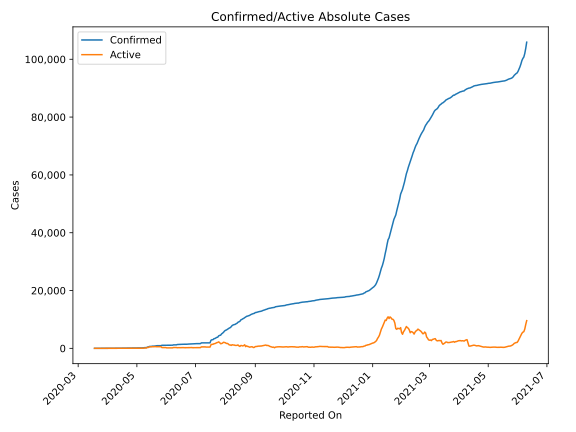
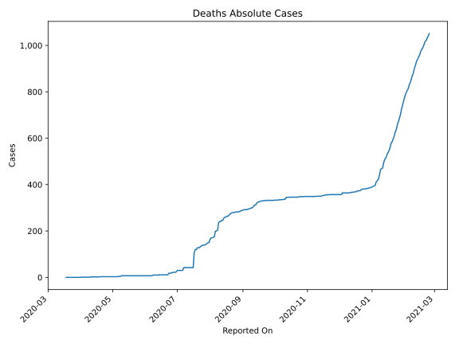
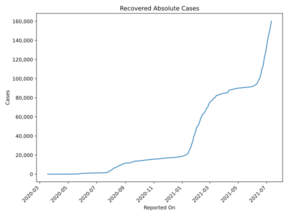
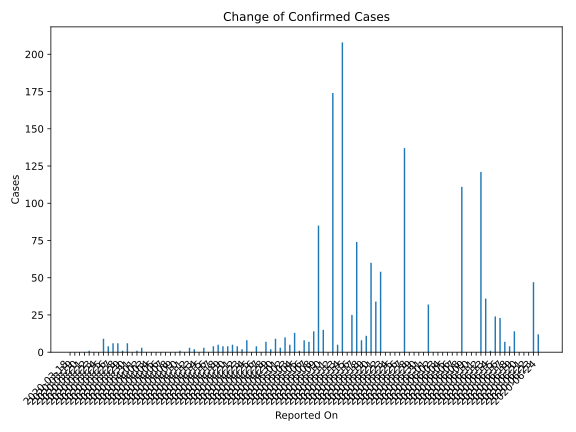
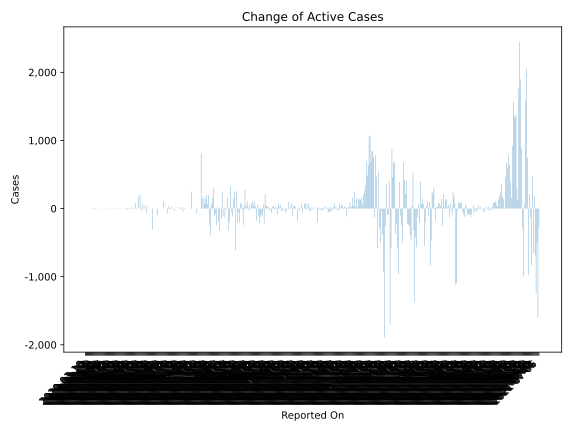
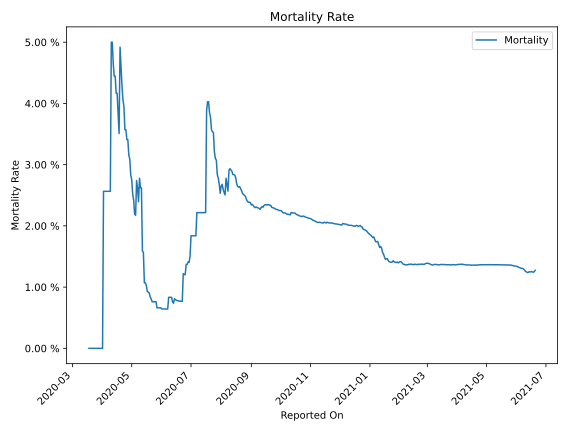

# Country Figures: Time Series for Zambia 

| Reported On | Confirmed | Deaths | Recovered | Active | Mortality | &Delta; Confirmed | &Delta; Deaths | &Delta; Recovered | &Delta; Active | % Active of Population |
|-------------|-----------|--------|-----------|--------|-----------|-------------------|----------------|-------------------|----------------|------------------------|
| 2020-04-28 | 95 | 3 | 42 | 50 |  3.16 %  | 7 | 0 | 0 | 7 |  0.000 %  | 
| 2020-04-27 | 88 | 3 | 42 | 43 |  3.41 %  | 0 | 0 | 0 | 0 |  0.000 %  | 
| 2020-04-26 | 88 | 3 | 42 | 43 |  3.41 %  | 4 | 0 | 5 | -1 |  0.000 %  | 
| 2020-04-25 | 84 | 3 | 37 | 44 |  3.57 %  | 0 | 0 | 0 | 0 |  0.000 %  | 
| 2020-04-24 | 84 | 3 | 37 | 44 |  3.57 %  | 8 | 0 | 0 | 8 |  0.000 %  | 
| 2020-04-23 | 76 | 3 | 37 | 36 |  3.95 %  | 2 | 0 | 2 | 0 |  0.000 %  | 
| 2020-04-22 | 74 | 3 | 35 | 36 |  4.05 %  | 4 | 0 | 0 | 4 |  0.000 %  | 
| 2020-04-21 | 70 | 3 | 35 | 32 |  4.29 %  | 5 | 0 | 0 | 5 |  0.000 %  | 
| 2020-04-20 | 65 | 3 | 35 | 27 |  4.62 %  | 4 | 0 | 2 | 2 |  0.000 %  | 
| 2020-04-19 | 61 | 3 | 33 | 25 |  4.92 %  | 4 | 1 | 0 | 3 |  0.000 %  | 
| 2020-04-18 | 57 | 2 | 33 | 22 |  3.51 %  | 5 | 0 | 3 | 2 |  0.000 %  | 
| 2020-04-17 | 52 | 2 | 30 | 20 |  3.85 %  | 4 | 0 | 0 | 4 |  0.000 %  | 
| 2020-04-16 | 48 | 2 | 30 | 16 |  4.17 %  | 0 | 0 | 0 | 0 |  0.000 %  | 
| 2020-04-15 | 48 | 2 | 30 | 16 |  4.17 %  | 3 | 0 | 0 | 3 |  0.000 %  | 
| 2020-04-14 | 45 | 2 | 30 | 13 |  4.44 %  | 0 | 0 | 0 | 0 |  0.000 %  | 
| 2020-04-13 | 45 | 2 | 30 | 13 |  4.44 %  | 2 | 0 | 0 | 2 |  0.000 %  | 
| 2020-04-12 | 43 | 2 | 30 | 11 |  4.65 %  | 3 | 0 | 2 | 1 |  0.000 %  | 
| 2020-04-11 | 40 | 2 | 28 | 10 |  5.00 %  | 0 | 0 | 3 | -3 |  0.000 %  | 
| 2020-04-10 | 40 | 2 | 25 | 13 |  5.00 %  | 1 | 1 | 1 | -1 |  0.000 %  | 
| 2020-04-09 | 39 | 1 | 24 | 14 |  2.56 %  | 0 | 0 | 17 | -17 |  0.000 %  | 
| 2020-04-08 | 39 | 1 | 7 | 31 |  2.56 %  | 0 | 0 | 0 | 0 |  0.000 %  | 
| 2020-04-07 | 39 | 1 | 7 | 31 |  2.56 %  | 0 | 0 | 2 | -2 |  0.000 %  | 
| 2020-04-06 | 39 | 1 | 5 | 33 |  2.56 %  | 0 | 0 | 2 | -2 |  0.000 %  | 
| 2020-04-05 | 39 | 1 | 3 | 35 |  2.56 %  | 0 | 0 | 1 | -1 |  0.000 %  | 
| 2020-04-04 | 39 | 1 | 2 | 36 |  2.56 %  | 0 | 0 | 0 | 0 |  0.000 %  | 
| 2020-04-03 | 39 | 1 | 2 | 36 |  2.56 %  | 0 | 0 | 2 | -2 |  0.000 %  | 
| 2020-04-02 | 39 | 1 | 0 | 38 |  2.56 %  | 3 | 1 | 0 | 2 |  0.000 %  | 
| 2020-04-01 | 36 | 0 | 0 | 36 |  None  | 1 | 0 | 0 | 1 |  0.000 %  | 
| 2020-03-31 | 35 | 0 | 0 | 35 |  None  | 0 | 0 | 0 | 0 |  0.000 %  | 
| 2020-03-30 | 35 | 0 | 0 | 35 |  None  | 6 | 0 | 0 | 6 |  0.000 %  | 
| 2020-03-29 | 29 | 0 | 0 | 29 |  None  | 1 | 0 | 0 | 1 |  0.000 %  | 
| 2020-03-28 | 28 | 0 | 0 | 28 |  None  | 6 | 0 | 0 | 6 |  0.000 %  | 
| 2020-03-27 | 22 | 0 | 0 | 22 |  None  | 6 | 0 | 0 | 6 |  0.000 %  | 
| 2020-03-26 | 16 | 0 | 0 | 16 |  None  | 4 | 0 | 0 | 4 |  0.000 %  | 
| 2020-03-25 | 12 | 0 | 0 | 12 |  None  | 9 | 0 | 0 | 9 |  0.000 %  | 
| 2020-03-24 | 3 | 0 | 0 | 3 |  None  | 0 | 0 | 0 | 0 |  0.000 %  | 
| 2020-03-23 | 3 | 0 | 0 | 3 |  None  | 0 | 0 | 0 | 0 |  0.000 %  | 
| 2020-03-22 | 3 | 0 | 0 | 3 |  None  | 1 | 0 | 0 | 1 |  0.000 %  | 
| 2020-03-21 | 2 | 0 | 0 | 2 |  None  | 0 | 0 | 0 | 0 |  0.000 %  | 
| 2020-03-20 | 2 | 0 | 0 | 2 |  None  | 0 | 0 | 0 | 0 |  0.000 %  | 
| 2020-03-19 | 2 | 0 | 0 | 2 |  None  | 0 | 0 | 0 | 0 |  0.000 %  | 
| 2020-03-18 | 2 | 0 | 0 | 2 |  None  | None | None | None | None |  0.000 %  | 

