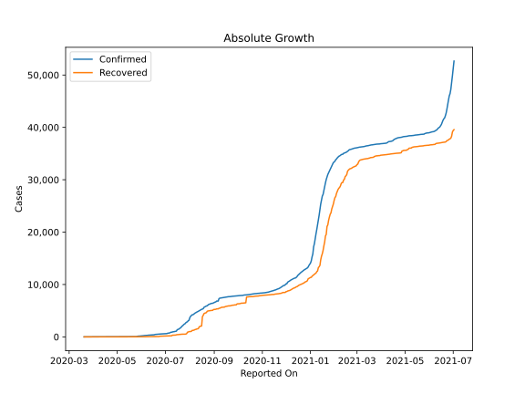
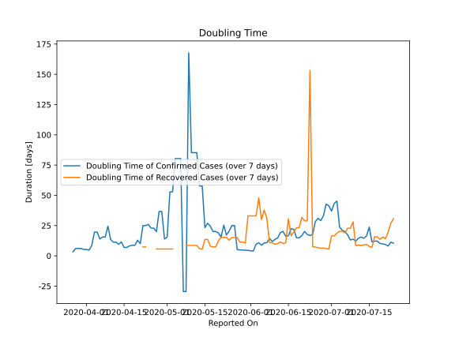

# Country Figures: Doubling Time of Infections for Zimbabwe 

The doubling time below are calculated based on
* an exponential growth assumption
* for time difference of past seven (7) days.
The doubling time's unit is "days".

The first doubling time indicates the increase of confirmed (infected)
cases. There, the *higher* the number is, the better is to take control
of the disease.

The second doubling time indicates the increase of recovered (healed)
cases. There, the *lower* the number is, the better it is to take
control of the disease.

| Reported On | Confirmed | Doubling Time (Confirmed) | Recovered | Doubling Time (Recovered) |
|-------------|-----------|---------------------------|-----------|---------------------------|
| 2020-05-08 | 34 |  -29.5 days  | 9 |  8.6 days  | 
| 2020-05-07 | 34 |  -29.5 days  | 5 |  None  | 
| 2020-05-06 | 34 |  80.4 days  | 5 |  None  | 
| 2020-05-05 | 34 |  80.4 days  | 5 |  None  | 
| 2020-05-04 | 34 |  80.4 days  | 5 |  None  | 
| 2020-05-03 | 34 |  52.9 days  | 5 |  5.6 days  | 
| 2020-05-02 | 34 |  52.9 days  | 5 |  5.6 days  | 
| 2020-05-01 | 40 |  15.4 days  | 5 |  5.6 days  | 
| 2020-04-30 | 40 |  13.9 days  | 5 |  5.6 days  | 
| 2020-04-29 | 32 |  36.7 days  | 5 |  5.6 days  | 
| 2020-04-28 | 32 |  36.7 days  | 5 |  5.6 days  | 
| 2020-04-27 | 32 |  20.0 days  | 5 |  5.6 days  | 
| 2020-04-26 | 31 |  22.9 days  | 2 |  None  | 
| 2020-04-25 | 31 |  22.9 days  | 2 |  None  | 
| 2020-04-24 | 29 |  26.0 days  | 2 |  None  | 
| 2020-04-23 | 28 |  25.0 days  | 2 |  7.3 days  | 
| 2020-04-22 | 28 |  25.0 days  | 2 |  7.3 days  | 
| 2020-04-21 | 28 |  10.1 days  | 2 |  None  | 
| 2020-04-20 | 25 |  12.9 days  | 2 |  None  | 
| 2020-04-19 | 25 |  8.7 days  | 2 |  None  | 
| 2020-04-18 | 25 |  8.7 days  | 2 |  None  | 
| 2020-04-17 | 24 |  8.3 days  | 2 |  None  | 
| 2020-04-16 | 23 |  6.9 days  | 1 |  None  | 
| 2020-04-15 | 23 |  6.9 days  | 1 |  None  | 
| 2020-04-14 | 17 |  11.5 days  | 0 |  None  | 
| 2020-04-13 | 17 |  9.5 days  | 0 |  None  | 
| 2020-04-12 | 14 |  11.3 days  | 0 |  None  | 
| 2020-04-11 | 14 |  11.3 days  | 0 |  None  | 
| 2020-04-10 | 13 |  13.5 days  | 0 |  None  | 
| 2020-04-09 | 11 |  24.5 days  | 0 |  None  | 
| 2020-04-08 | 11 |  15.6 days  | 0 |  None  | 
| 2020-04-07 | 11 |  15.6 days  | 0 |  None  | 
| 2020-04-06 | 10 |  13.9 days  | 0 |  None  | 
| 2020-04-05 | 9 |  19.7 days  | 0 |  None  | 
| 2020-04-04 | 9 |  19.7 days  | 0 |  None  | 
| 2020-04-03 | 9 |  8.6 days  | 0 |  None  | 
| 2020-04-02 | 9 |  4.8 days  | 0 |  None  | 
| 2020-04-01 | 8 |  5.3 days  | 0 |  None  | 
| 2020-03-31 | 8 |  5.3 days  | 0 |  None  | 
| 2020-03-30 | 7 |  6.1 days  | 0 |  None  | 
| 2020-03-29 | 7 |  6.1 days  | 0 |  None  | 
| 2020-03-28 | 7 |  6.1 days  | 0 |  None  | 
| 2020-03-27 | 5 |  3.3 days  | 0 |  None  | 
| 2020-03-26 | 3 |  None  | 0 |  None  | 
| 2020-03-25 | 3 |  None  | 0 |  None  | 
| 2020-03-24 | 3 |  None  | 0 |  None  | 
| 2020-03-23 | 3 |  None  | 0 |  None  | 
| 2020-03-22 | 3 |  None  | 0 |  None  | 
| 2020-03-21 | 3 |  None  | 0 |  None  | 
| 2020-03-20 | 1 |  None  | 0 |  None  | 

