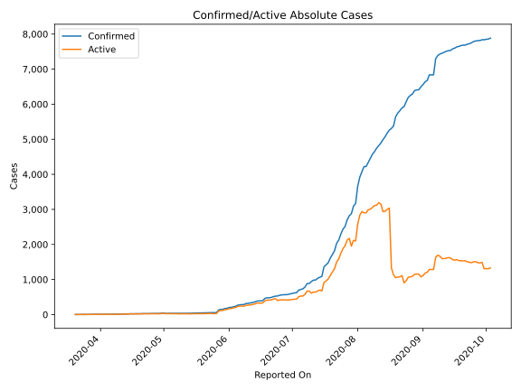
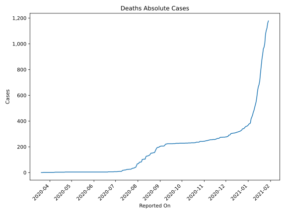
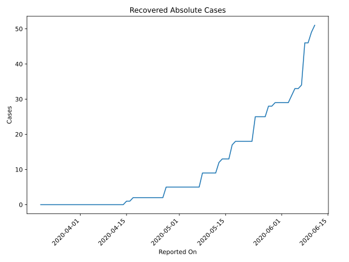
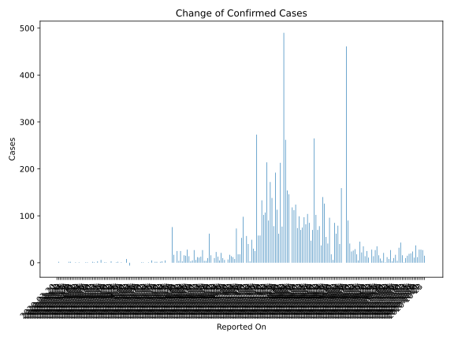
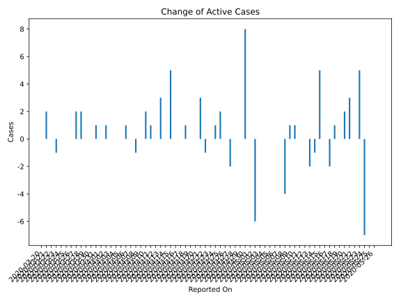
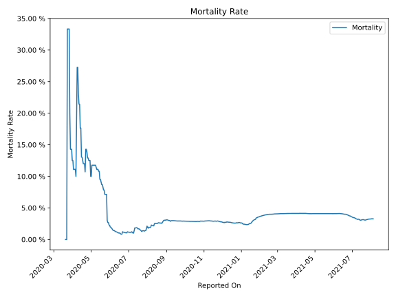

# Country Figures: Time Series for Zimbabwe 

| Reported On | Confirmed | Deaths | Recovered | Active | Mortality | &Delta; Confirmed | &Delta; Deaths | &Delta; Recovered | &Delta; Active | % Active of Population |
|-------------|-----------|--------|-----------|--------|-----------|-------------------|----------------|-------------------|----------------|------------------------|
| 2020-04-28 | 32 | 4 | 5 | 23 |  12.50 %  | 0 | 0 | 0 | 0 |  0.000 %  | 
| 2020-04-27 | 32 | 4 | 5 | 23 |  12.50 %  | 1 | 0 | 3 | -2 |  0.000 %  | 
| 2020-04-26 | 31 | 4 | 2 | 25 |  12.90 %  | 0 | 0 | 0 | 0 |  0.000 %  | 
| 2020-04-25 | 31 | 4 | 2 | 25 |  12.90 %  | 2 | 0 | 0 | 2 |  0.000 %  | 
| 2020-04-24 | 29 | 4 | 2 | 23 |  13.79 %  | 1 | 0 | 0 | 1 |  0.000 %  | 
| 2020-04-23 | 28 | 4 | 2 | 22 |  14.29 %  | 0 | 0 | 0 | 0 |  0.000 %  | 
| 2020-04-22 | 28 | 4 | 2 | 22 |  14.29 %  | 0 | 1 | 0 | -1 |  0.000 %  | 
| 2020-04-21 | 28 | 3 | 2 | 23 |  10.71 %  | 3 | 0 | 0 | 3 |  0.000 %  | 
| 2020-04-20 | 25 | 3 | 2 | 20 |  12.00 %  | 0 | 0 | 0 | 0 |  0.000 %  | 
| 2020-04-19 | 25 | 3 | 2 | 20 |  12.00 %  | 0 | 0 | 0 | 0 |  0.000 %  | 
| 2020-04-18 | 25 | 3 | 2 | 20 |  12.00 %  | 1 | 0 | 0 | 1 |  0.000 %  | 
| 2020-04-17 | 24 | 3 | 2 | 19 |  12.50 %  | 1 | 0 | 1 | 0 |  0.000 %  | 
| 2020-04-16 | 23 | 3 | 1 | 19 |  13.04 %  | 0 | 0 | 0 | 0 |  0.000 %  | 
| 2020-04-15 | 23 | 3 | 1 | 19 |  13.04 %  | 6 | 0 | 1 | 5 |  0.000 %  | 
| 2020-04-14 | 17 | 3 | 0 | 14 |  17.65 %  | 0 | 0 | 0 | 0 |  0.000 %  | 
| 2020-04-13 | 17 | 3 | 0 | 14 |  17.65 %  | 3 | 0 | 0 | 3 |  0.000 %  | 
| 2020-04-12 | 14 | 3 | 0 | 11 |  21.43 %  | 0 | 0 | 0 | 0 |  0.000 %  | 
| 2020-04-11 | 14 | 3 | 0 | 11 |  21.43 %  | 1 | 0 | 0 | 1 |  0.000 %  | 
| 2020-04-10 | 13 | 3 | 0 | 10 |  23.08 %  | 2 | 0 | 0 | 2 |  0.000 %  | 
| 2020-04-09 | 11 | 3 | 0 | 8 |  27.27 %  | 0 | 0 | 0 | 0 |  0.000 %  | 
| 2020-04-08 | 11 | 3 | 0 | 8 |  27.27 %  | 0 | 1 | 0 | -1 |  0.000 %  | 
| 2020-04-07 | 11 | 2 | 0 | 9 |  18.18 %  | 1 | 1 | 0 | 0 |  0.000 %  | 
| 2020-04-06 | 10 | 1 | 0 | 9 |  10.00 %  | 1 | 0 | 0 | 1 |  0.000 %  | 
| 2020-04-05 | 9 | 1 | 0 | 8 |  11.11 %  | 0 | 0 | 0 | 0 |  0.000 %  | 
| 2020-04-04 | 9 | 1 | 0 | 8 |  11.11 %  | 0 | 0 | 0 | 0 |  0.000 %  | 
| 2020-04-03 | 9 | 1 | 0 | 8 |  11.11 %  | 0 | 0 | 0 | 0 |  0.000 %  | 
| 2020-04-02 | 9 | 1 | 0 | 8 |  11.11 %  | 1 | 0 | 0 | 1 |  0.000 %  | 
| 2020-04-01 | 8 | 1 | 0 | 7 |  12.50 %  | 0 | 0 | 0 | 0 |  0.000 %  | 
| 2020-03-31 | 8 | 1 | 0 | 7 |  12.50 %  | 1 | 0 | 0 | 1 |  0.000 %  | 
| 2020-03-30 | 7 | 1 | 0 | 6 |  14.29 %  | 0 | 0 | 0 | 0 |  0.000 %  | 
| 2020-03-29 | 7 | 1 | 0 | 6 |  14.29 %  | 0 | 0 | 0 | 0 |  0.000 %  | 
| 2020-03-28 | 7 | 1 | 0 | 6 |  14.29 %  | 2 | 0 | 0 | 2 |  0.000 %  | 
| 2020-03-27 | 5 | 1 | 0 | 4 |  20.00 %  | 2 | 0 | 0 | 2 |  0.000 %  | 
| 2020-03-26 | 3 | 1 | 0 | 2 |  33.33 %  | 0 | 0 | 0 | 0 |  0.000 %  | 
| 2020-03-25 | 3 | 1 | 0 | 2 |  33.33 %  | 0 | 0 | 0 | 0 |  0.000 %  | 
| 2020-03-24 | 3 | 1 | 0 | 2 |  33.33 %  | 0 | 0 | 0 | 0 |  0.000 %  | 
| 2020-03-23 | 3 | 1 | 0 | 2 |  33.33 %  | 0 | 1 | 0 | -1 |  0.000 %  | 
| 2020-03-22 | 3 | 0 | 0 | 3 |  None  | 0 | 0 | 0 | 0 |  0.000 %  | 
| 2020-03-21 | 3 | 0 | 0 | 3 |  None  | 2 | 0 | 0 | 2 |  0.000 %  | 
| 2020-03-20 | 1 | 0 | 0 | 1 |  None  | None | None | None | None |  0.000 %  | 

